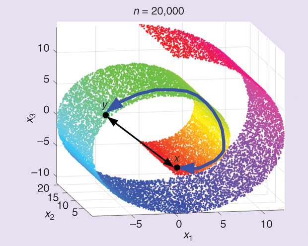

## Data Visualisation (When data is  high dimensional)

Embeddings (numeric representation of words) are of 100s dimensional and we can have 50K words (vocabulary size) and it is hard to visualise, so we can reduce its dimensionality to 2 or 3 so we can visualise.

Principal Component Analysis (PCA) is a dimensionality reduction method that is often used to reduce the dimensionality

so it can able to reduce 100X50K dimension into 2(or 3)X50K dimension for visualisation

>Objective is to convert High dimensional data into Low dimensional data (based on percentage variance capture)

Two sides of data visualisation 
1. data exploration
2. data communication

**TODO:  
#### Why data visualisation ?

#### Dimensionality Reduction

dimensionality reduction retains the behaviour of high dimensional data in low dimensions
Dimensionality reduction approaches
1. Global approach - all the distance in high dimensional is equally important in low dimensional
2. Local approach - small distance in high dimensional is meaningful for us

so we choose local approach because to preserve the behaviour of the points in high dimension which were closer to each other

Formal Framework
minimise an objective function that measures the discrepancy between similarities in the high dimensional data and similarities between low dimensional data (map)

Multi-Dimensional Scaling (MDS)

global approach

| $Cost = \sum_{i < j} (d_{ij} - \hat{d}_{ij})^2$ ; $d_{ij} = \|x_i - x_j\|^2$    | 
| --- |

Here $d_{ij}$ is the euclidean distance for high dimensional data and $\hat{d}_{ij}$ for low dimensional data

1. can stuck in local minima
2. still linear can be PCA

limitations
1. it may lose the quality of mapping for smaller distances, think of data spread like a chicken roll, manifold distance or geodesic distance (where euclidian distance is smaller than the manifold  distance)

## Non Linear Dimensionality Reduction

#### Isometric Mapping (ISOMAP)

###### Steps
1. Connect each datapoints with its k neighbours in high dimensional space (link with euclidean distance)
2. Calculate Manifold Distance (MD) = ShortestPath(A, B), (using Dijkstra's algorithm) in the neighbour graph
3. Compute the low dimensional embedding using MDS (replace euclidean distance with manifold distance)

###### Limitations with ISOMAP
1. The connectivity of each datapoints in the graph is defined as its nearest k euclidean neighbours in the high dimensional space. 
	1. This is vulnerable to **short-circuit error**, if k is too large with respect to the manifold structure, or 
	2. If noise in the data moves the point slightly off the manifold
2. Conversely, if k is too small, the neighbour graph map become too sparse to approximate geodesic paths accurately

#### Locally Linear Embedding (LLE)

preserve the structure of local neighbourhood

| $$x_i  \approx \sum_j w_{ij}x_j$$    | 
| --- |
#### Steps
1. Represent each point as a weighted combination of its neighbours in high dimensional space 

## T-distributed Stochastic Neighbour Embedding (t-SNE)
similar algorithm but the best

#### SNE and t-SNE

Instead of distance think about probability. $P_{ij}$ as the probability of $j$ in the neighbourhood of $i$
For each point we have now a probability vector (of size N). 
	SNE uses Gaussian, t-SNE uses another t-distribution with 1 degree of freedom

| $$P_{j\|i} = {e^{{-\|x_i - x_j\|^2} / 2\sigma_i^2} \over \sum_{k \ne i} e^{{-\|x_i - x_k\|^2 / 2\sigma_i^2}}}$$    | 
| --- |

t-SNE, or t-Distributed Stochastic Neighbor Embedding, is a dimensionality reduction technique that works by first measuring the similarity between pairs of data points in a high-dimensional space. Here's a step-by-step breakdown of how t-SNE works:

1. Calculate similarities: For each pair of data points in the high-dimensional space, t-SNE computes a measure of similarity. This similarity is based on the probability distribution of pairwise similarities, where nearby points are considered more similar than distant points.
2. Construct probability distributions: t-SNE converts the similarities between data points into conditional probability distributions. These distributions represent the likelihood of picking one point as a neighbor of another point, given their similarities.
3. Random initialization: t-SNE randomly places the data points in a lower-dimensional space (usually 2D or 3D). This creates an initial configuration of points in the lower-dimensional space.
4. Optimization: t-SNE aims to find a lower-dimensional representation of the data that best preserves the pairwise similarities calculated in step 1. It does this by minimizing a cost function, such as the Kullback-Leibler (KL) divergence, which measures the difference between the conditional probability distributions in the high-dimensional space and the lower-dimensional space.
5. Gradient descent: t-SNE typically uses gradient descent or a similar optimization algorithm to minimize the cost function. During this process, it adjusts the positions of the data points in the lower-dimensional space to better match the similarities between them in the high-dimensional space.
6. Iterative refinement: The optimization process continues iteratively until the algorithm converges to a stable solution. At each iteration, t-SNE updates the positions of the data points in the lower-dimensional space based on the gradients of the cost function.
7. Visualization: Once the optimization converges, t-SNE outputs the final positions of the data points in the lower-dimensional space. These positions can then be visualized using a scatter plot or other techniques, allowing you to explore the structure and relationships within the data.

Overall, t-SNE is a powerful tool for visualizing high-dimensional data in a lower-dimensional space while preserving the underlying structure and relationships between data points. It's commonly used in exploratory data analysis, clustering, and visualization tasks in machine learning and data science.