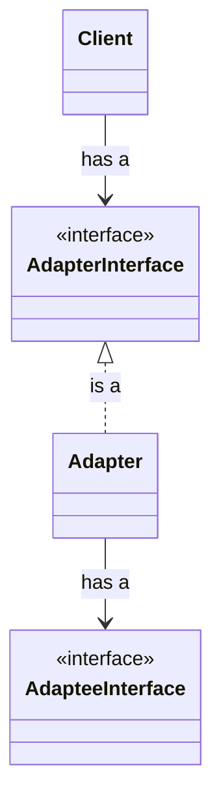

Adapter design pattern is a structural design pattern that allows objects with incompatible interfaces to collaborate. It is a bridge between expected interface and existing interface

## Problem

## Solution

