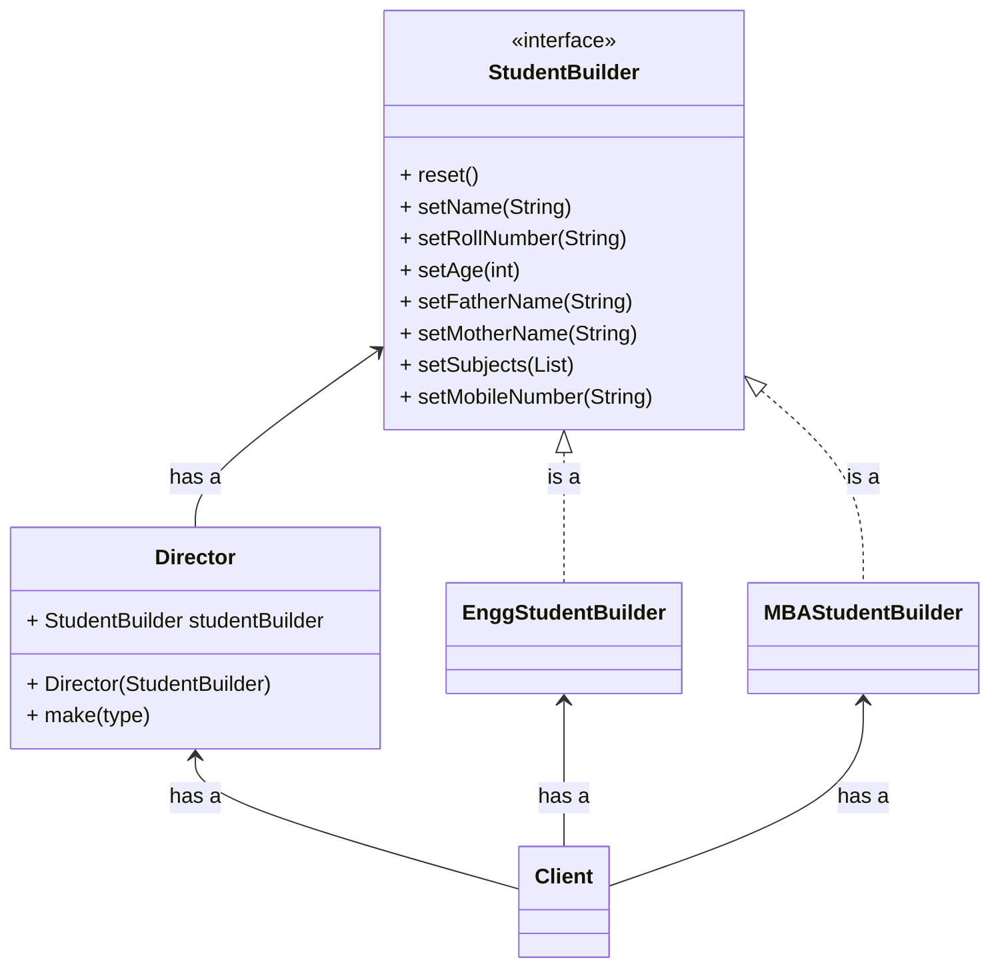

**Creational Design Pattern**
**Create Objects Step By Step**

## Problem

Lets assume a object having many optional parameters

```java
public class Student {
	int rollNumber;        // mandatory
	int age;               // optional
	String name;           // optional
	String fatherName;     // optional
	String motherName;     // optional
	List<String> subjects; // optional
	String mobileNumber;   // optional 

	public Student(int rollNumber, int age, String name, String fatherName, String motherName, List<String> subjects, String mobileNumber) {
		this.rollNumber = rollNumber;
		this.age = age;
		this.name = name;
		this.fatherName = fatherName;
		this.motherName = motherName;
		this.subjects = subjects;
		this.mobileNumber = mobileNumber;
	}
}
```

```java
public class Student {
	int rollNumber;        // mandatory
	int age;               // optional
	String name;           // optional
	String fatherName;     // optional
	String motherName;     // optional
	List<String> subjects; // optional
	String mobileNumber;   // optional 

	public Student(int rollNumber, int age) {
		this.rollNumber = rollNumber;
		this.age = age;
	}

	public Student(int rollNumber, int age, String name) {
		this.rollNumber = rollNumber;
		this.age = age;
		this.name = name;
	}

	// and so on for every combination.
}
```

1. Big constructor parameter list, because of so many optional parameters
2. Multiple constructor for every parameter combination
3. Also get compilation error if any two constructor signature is same although the parameters are different.
```java
public Student(int rollNumber, int age, String name) {
	this.rollNumber = rollNumber;
	this.age = age;
	this.name = name;
}

public Student(int rollNumber, int age, String fatherName) {
	this.rollNumber = rollNumber;
	this.age = age;
	this.fatherName = fatherName;
}

// this will throw error as the signature are same
```


## Solution





```java
public abstract class StudentBuilder {
	public int rollNumber;        
	public int age;              
	public String name;          
	public String fatherName;    
	public String motherName;     
	public List<String> subjects; 
	public String mobileNumber;
	
	public StudentBuilder setRollNumber(int rollNumber) {
		this.rollNumber = rollNumber;
		return this;
	}

	public StudentBuilder setAge(int age) {
		this.age = age;
		return this;
	}

	public StudentBuilder setName(String name) {
		this.name = name;
		return this;
	}

	public StudentBuilder setFatherName(String fatherName) {
		this.fatherName = fatherName;
		return this;
	}

	public StudentBuilder setMotherName(String motherName) {
		this.motherName = motherName;
		return this;
	}

	public StudentBuilder setSubjects(List<String> subjects) {
		this.subjects = subjects;
		return this;
	}

	public StudentBuilder setMobileNumber(String mobileNumber) {
		this.mobileNumber = mobileNumber;
		return this;
	}
}
```

```java
public class Student {
	private int rollNumber;        
	private int age;              
	private String name;          
	private String fatherName;    
	private String motherName;     
	private List<String> subjects; 
	private String mobileNumber;

	public Student(StudentBuilder builder) {
		this.rollNumber = builder.rollNumber;
		this.age = builder.age;
		this.name = builder.name;
		this.fatherName = builder.fatherName;
		this.motherName = builder.motherName;
		this.subjects = builder.subjects;
		this.mobileNumber = builder.mobileNumber;
	}

	public String toString() {
		return "RollNumber: " + this.rollNumber + " Name: " + this.name;
		 
	}
}
```

## Pros & Cons

| Pros | Cons |
| ---- | ---- |
|      |  Duplicate code    |


## Builder vs Decorator

Builder design pattern is a creational pattern responsible for creation of an object
It can not handle dynamic steps

Decorator design pattern is a structural pattern which helps you in creating complex object
It can handle dynamic steps

## Reference
1. [Refactoring Guru / Builder](https://refactoring.guru/design-patterns/builder)
2. [YouTube / Concept and Coding / Builder](https://www.youtube.com/watch?v=qOLRxN5eVC0)