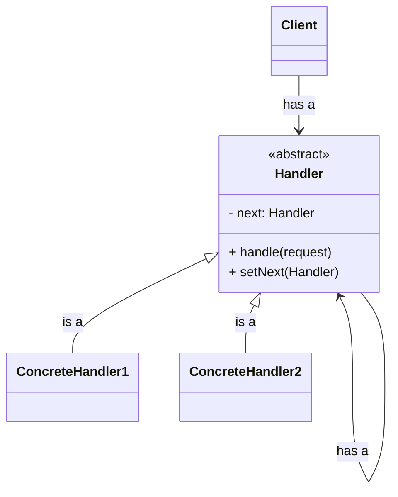
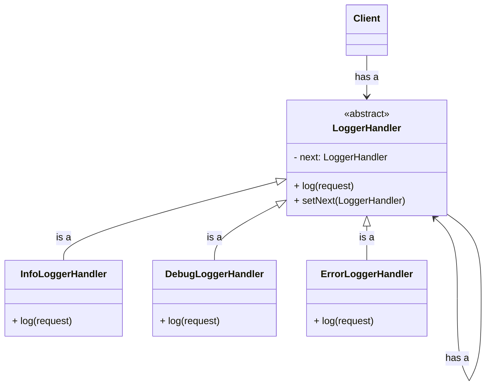

It pass requests along a chain of handlers. Upon receiving a request, each handler decides either to process the request or to pass it to the next handler in the chain.

Examples are 
1. ATM
2. Vending Machine
3. Logger


## Structure




## Example

### Class Diagram



### Code

```java
public abstract class LoggerHandler {
	private LoggerHandler next;

	public void setNext(LoggerHandler nextLoggerHandler) {
		this.next = nextLoggerHandler;
	}

	public void log(int logLevel, String message) {
		if (next != null) {
			next.log(logLevel, message);
		}
	}
}
```

```java
public class InfoLoggerHandler extends LoggerHandler {
	public void log(int logLevel, String message) {
		if (logLevel == 1) {
			System.out.println("Info: " + message);
		} else {
			super.log(logLevel, message);
		}
	}
}
```

```java
public class DebugLoggerHandler extends LoggerHandler {
	public void log(int logLevel, String message) {
		if (logLevel == 2) {
			System.out.println("Debug: " + message);
		} else {
			super.log(logLevel, message);
		}
	}
}
```

```java
public class ErrorLoggerHandler extends LoggerHandler {
	public void log(int logLevel, String message) {
		if (logLevel == 3) {
			System.out.println("Error: " + message);
		} else {
			super.log(logLevel, message);
		}
	}
}
```

```java
public class Main {
	public static void main(String args[]) {
		LoggerHandler logger = new InfoLoggerHandler();
		LoggerHandler logger2 = new DebugLoggerHandler();
		LoggerHandler logger3 = new ErrorLoggerHandler();

		logger.setNext(logger2);
		logger2.setNext(logger3);
        
        logger.log(3, "Hi"); // Error: Hi
        logger.log(1, "Hi"); // Info: Hi
        logger.log(2, "Hi"); // Debug: Hi
	}
}
```