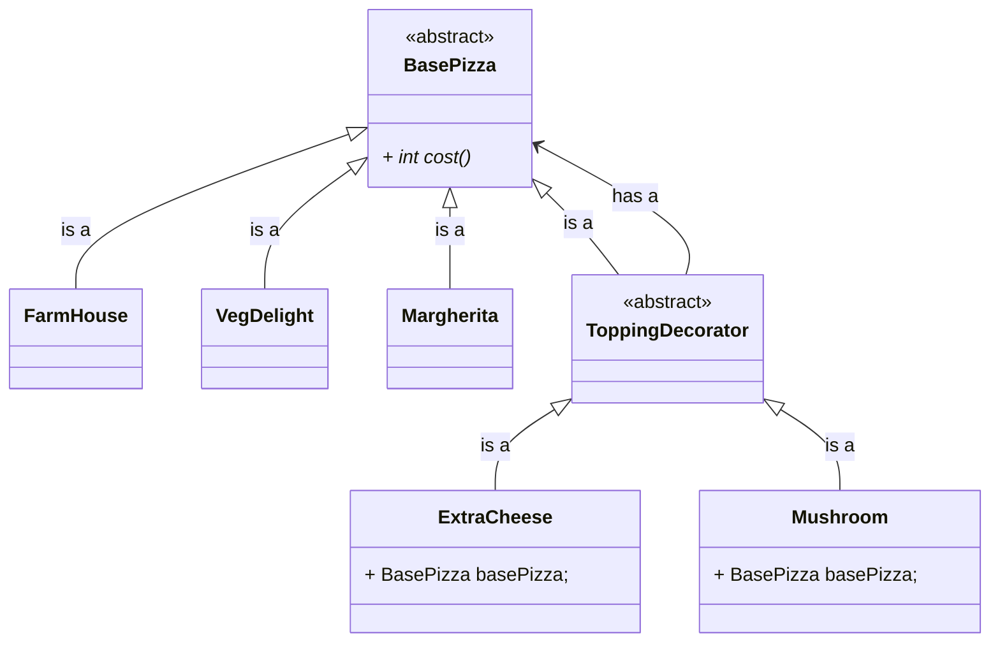

```java
public abstract class BasePizza {
	public abstract int cost();
}
```

```java
public abstract class ToppingDecorator extends BasePizza {}
```

```java
public class FarmHouse extends BasePizza {
	
	@Override
	public int cost() {
		return 200
	}
}
```

```java
public class VegDelight extends BasePizza {

	@Override
	public int cost() {
		return 140
	}
}
```

```java
public class Margherita extends BasePizza {

	@Override
	public int cost() {
		return 180
	}
}
```

```java
public class ExtraCheese extends ToppingDecorator {
	BasePizza basePizza;

	public ExtraCheese(BasePizza basePizza) {
		this.basePizza = basePizza;
	}

	@Override
	public int cost() {
		return this.basePizza.cost() + 50;
	}
}
```

```java
public class Mushroom extends ToppingDecorator {
	BasePizza basePizza;

	public Mushroom(BasePizza basePizza) {
		this.basePizza = basePizza;
	}

	@Override
	public int cost() {
		return this.basePizza.cost() + 80;
	}
}
```
