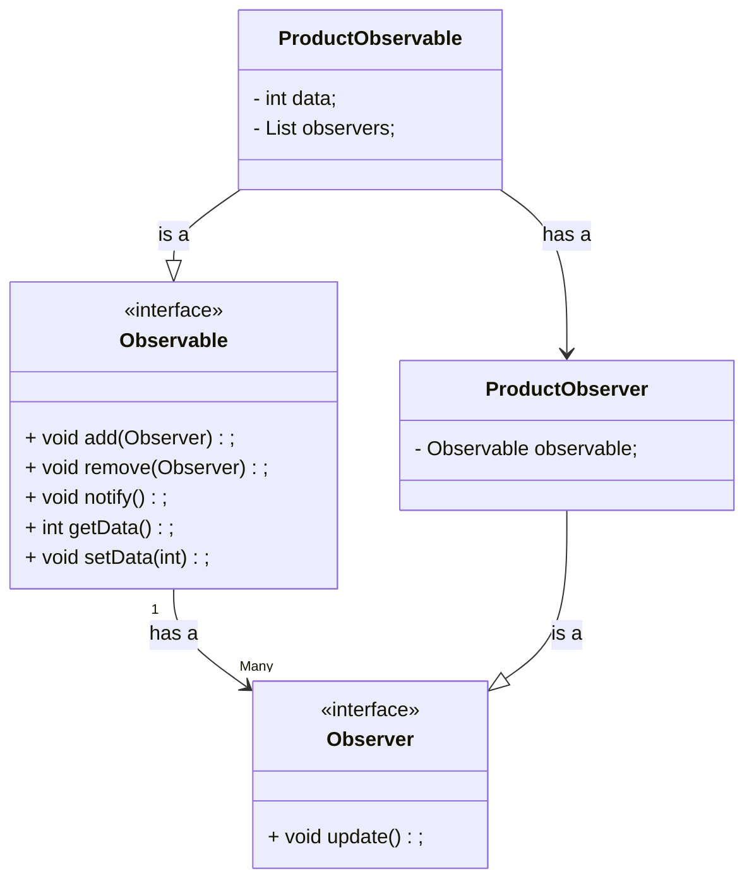
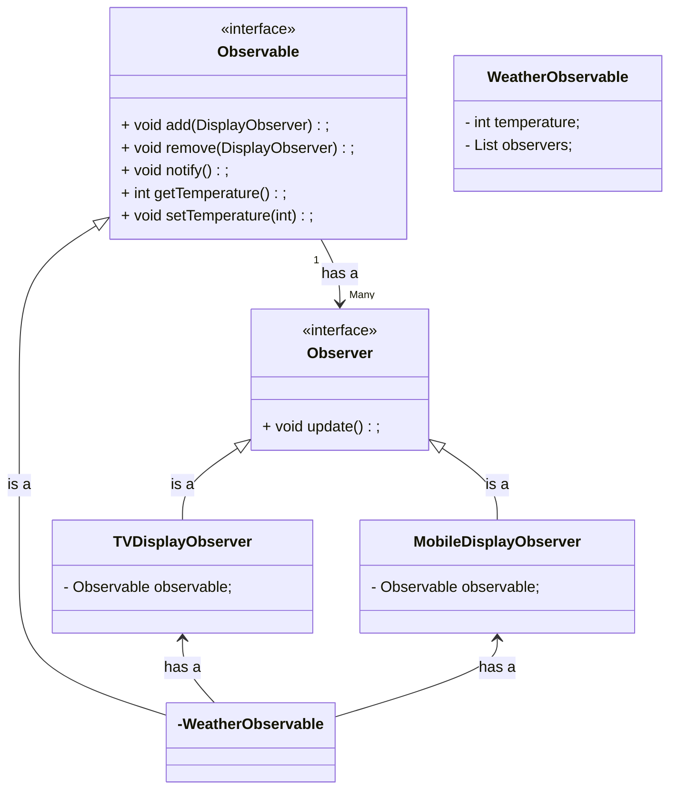
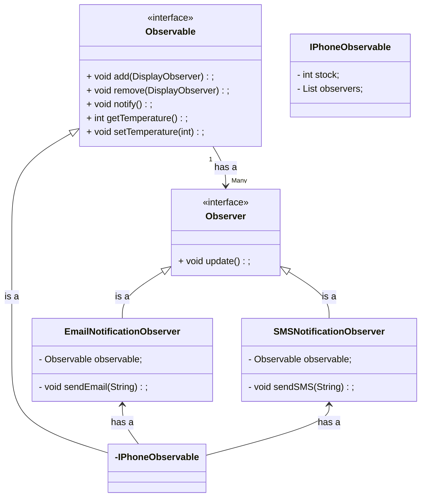

## Problem Statement

In any e-commerce website if a product is Out of Stock we can able to see Notify Me option, so that when ever that product will be available we will get the notification.

Implement Notify Me

---
First learn Observer Design Pattern




```java
public interface Observable {
	void add(Observer observer);
	void remove(Observer observer);
	void notify();
	int getData();
	void setData(int data);
}
```

```java
public interface Observer {
	void update();
}
```

```java
public class ProductObservable implements Observable {
	int data;
	List<Observer> observers;

	@Override
	void add(Observer observer) {
		this.observers.add(observer);
	}

	@Override
	void remove(Observer observer) {
		this.observers.remove(observer);
	}

	@Override
	void notify() {
		for (Observer observer: this.observers) {
			observer.update();
		}
	}

	@Override
	int getData() {
		return this.data;
	}

	@Override
	void setData(int data) {
		this.data = data;
		notify();
	}
}
```

```java
public class ProductObserver implements Observer {
	Observable observable;

	public ProductObserver(Observable observable) {
		this.observable = observable;
	}

	@Override
	void update() {
		int data = this.observable.getData();
		// we can perform any action with the data.
	}
}
```

---
Example: Weather Station, It need to set current temperature in every 5 mins. It has multiple observer like TVDisplay, MobileDisplay etc.




```java
public interface Observable {
	void add(Observer observer);
	void remove(Observer observer);
	void notify();
	int getData();
	void setData(int data);
}
```

```java
public interface Observer {
	void update();
}
```

```java
public class WeatherObservable implements Observable {
	int temperature;
	List<Observer> observers = new ArrayList<>();

	@Override
	void add(Observer observer) {
		this.observers.add(observer);
	}

	@Override
	void remove(Observer observer) {
		this.observers.remove(observer);
	}

	@Override
	void notify() {
		for (Observer observer: this.observers) {
			observer.update();
		}
	}

	@Override
	int getData() {
		return this.temperature;
	}

	@Override
	void setData(int temperature) {
		this.temperature = temperature;
		notify();
	}
}
```

```java
public class TVDisplayObserver implements Observer {
	Observable observable;

	public TVDisplayObserver(Observable observable) {
		this.observable = observable;
	}

	@Override
	void update() {
		int temperature = this.observable.getData();
		// we can display the temperature in TV display
	}
}
```

```java
public class MobileDisplayObserver implements Observer {
	/** 
	this observer can observer multiple observable, 
	so using constructor we ca assign which observable to observer.
	unless we have to pass observable in update method to get the data.
	**/
	Observable observable;

	public MobileDisplayObserver(Observable observable) {
		this.observable = observable;
	}

	@Override
	void update() {
		int temperature = this.observable.getData();
		// we can display the temperature in Mobile display
	}
}
```


---
Notify Me 




```java
public interface Observable {
	void add(Observer observer);
	void remove(Observer observer);
	void notify();
	int getData();
	void setData(int data);
}
```

```java
public interface Observer {
	void update();
}
```

```java
public class IPhoneObservable implements Observable {
	int stock = 0;
	List<Observer> observers = new ArrayList<>();

	@Override
	void add(Observer observer) {
		this.observers.add(observer);
	}

	@Override
	void remove(Observer observer) {
		this.observers.remove(observer);
	}

	@Override
	void notify() {
		for (Observer observer: this.observers) {
			observer.update();
		}
	}

	@Override
	int getData() {
		return this.temperature;
	}

	@Override
	void setData(int stock) {
		this.stock += stock;
		notify();
	}
}
```

```java
public class EmailNotificationObserver implements Observer {
	String email;
	Observable observable;

	public EmailNotificationObserver(String email, Observable observable) {
		this.email = email;
		this.observable = observable;
	}

	@Override
	void update() {
		if (this.observable.getData() > 0) {
			this.sendEmail("Product is available")
		}
	}

	private void sendEmail(String message) {
		System.out.println("SMS sends to " + this.email);
	}
}
```

```java
public class SMSNotificationObserver implements Observer {
	String mobileNumber;
	Observable observable;

	public SMSNotificationObserver(String mobileNumber, Observable observable) {
		this.mobileNumber = mobileNumber;
		this.observable = observable;
	}

	@Override
	void update() {
		if (this.observable.getData() > 0) {
			this.sendSMS("Product is available")
		}
	}

	private void sendSMS(String message) {
		System.out.println("SMS sends to " + this.mobileNumber);
	}
}
```

```java
public class AmazonNotifyMe {
	public static void main(String args[]) {
		Observable iphoneStockObservable = new IPhoneStockObservable();

		Observer observer1 = new EmailNotificationObserver("person1@gmail.com", iphoneStockObservable);
		Observer observer2 = new EmailNotificationObserver("person1@gmail.com", iphoneStockObservable);
		Observer observer3 = new SMSNotificationObserver("1234567890", iphoneStockObservable);
		Observer observer4 = new SMSNotificationObserver("0987654321", iphoneStockObservable);


		iphoneStockObservable.add(observer1);
		iphoneStockObservable.add(observer2);
		iphoneStockObservable.add(observer3);
		iphoneStockObservable.add(observer4);

		iphoneStockObservable.setData(10);
	}
}
```

