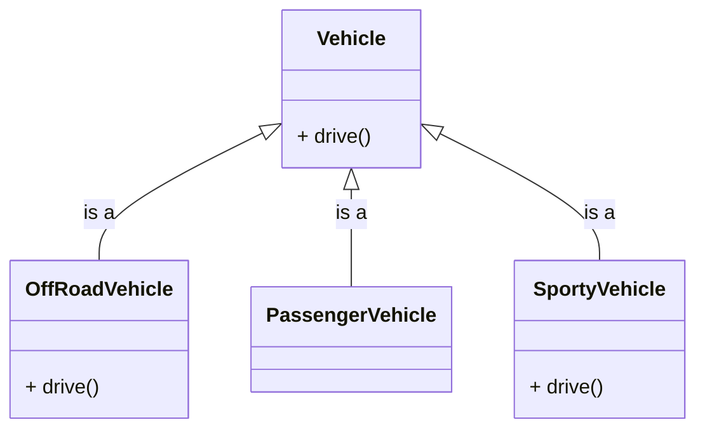
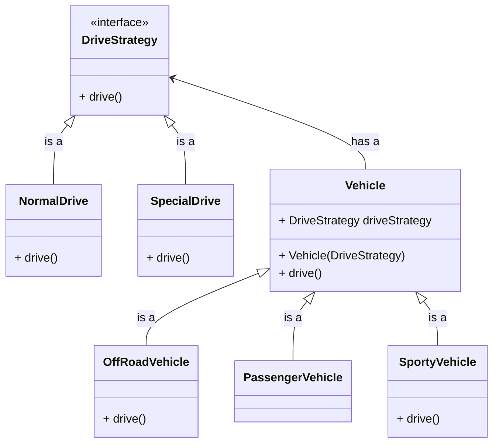

---
Child classes having same code which is not present is the parent class 

---
## Problem



```java
public class Vehicle {
	public void drive() {
		// normal drive capability
		System.out.println("Drive at a max speed of 40 Kmph");
	}
}
```

```java
public class OffRoadVehicle extends Vehicle {
	@Override
	public void drive() {
		// special drive capability
		System.out.println("Drive at a max speed of 100 Kmph");
	}
}
```

```java
public class PassengerVehicle extends Vehicle {
	
}
```

```java
public class SportyVehicle extends Vehicle {
	@Override
	public void drive() {
		// special drive capability
		System.out.println("Drive at a max speed of 100 Kmph");
	}
}
```


> **Note:** Here child class of Vehicle class has duplicate code for special drive capability, In this situation we can use strategy design pattern

---
## Solution





```java
public interface DriveStrategy {
	void drive();
}
```

```java
public class NormalDrive implements DriveStrategy {

	@Override
	void drive() {
		// normal drive capability
		System.out.println("Drive at a max speed of 40 Kmph");
	}
}
```

```java
public class SpecialDrive implements DriveStrategy {

	@Override
	void drive() {
		// special drive capability
		System.out.println("Drive at a max speed of 100 Kmph");
	}
}
```

```java
public class Vehicle {
	private DriveStrategy driveStrategy;

	public Vehicle(DriveStrategy driveStrategy) {
		this.driveStrategy = driveStrategy;
	}

	public void drive() {
		driveStrategy.drive();
	}
}
```

```java
public class OffRoadVehicle extends Vehicle {

	public OffRoadVehicle() {
		super(new SpecialDrive());
	}
}
```

```java
public class PassengerVehicle extends Vehicle {
	public PassengerVehicle() {
		super(new NormalDrive());
	}
}
```

```java
public class SportyVehicle extends Vehicle {
	public SportyVehicle() {
		super(new SpecialDrive());
	}
}
```

```java
public class Main {
	public static void main(String args[]) {
		Vehicle offroadVehicle = new OffRoadVehicle();
		offroadVehicle.drive();
	}
}
```


