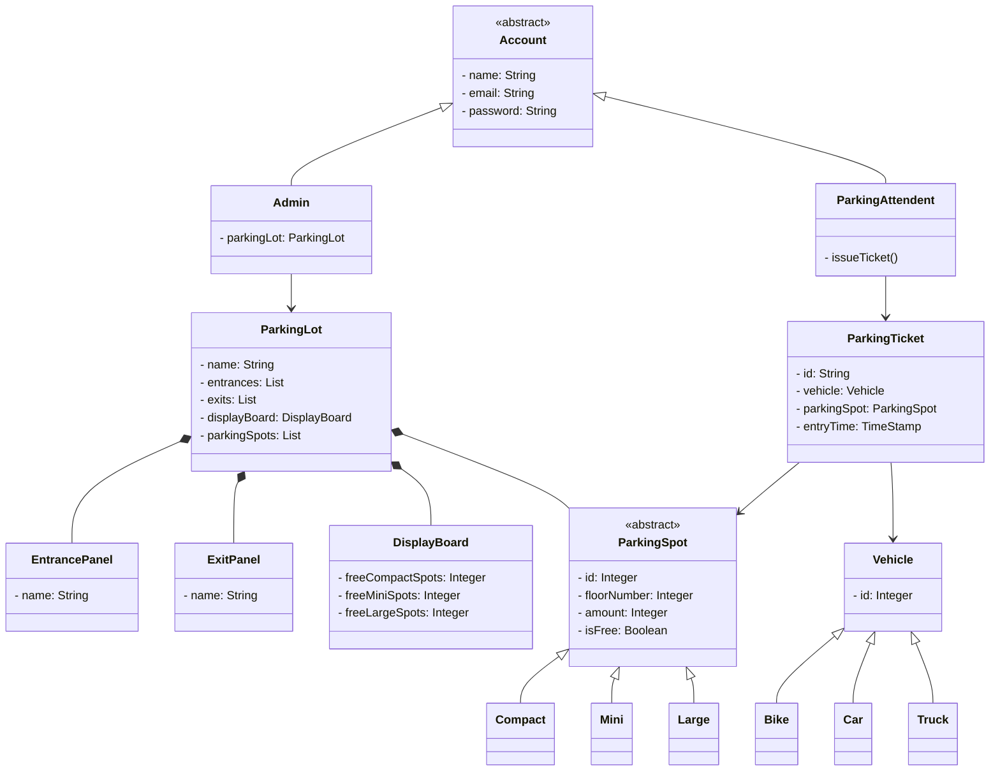

```mermaid

classDiagram
    
	%% @startuml %%
	class ParkingLot {
		- name: String
	    - entrances: List<EntrancePanel>
	    - exits: List<ExitPanel>
	    - displayBoard: DisplayBoard
	    - parkingSpots: List<ParkingSpot>
	}
	
	class EntrancePanel {
		- name: String
	}
	
	class ExitPanel {
		- name: String
	}
	
	class DisplayBoard {
		- freeCompactSpots: Integer
		- freeMiniSpots: Integer
		- freeLargeSpots: Integer
	}
	
	class ParkingSpot {
		<<abstract>>
		- id: Integer
	    - floorNumber: Integer
	    - amount: Integer
	    - isFree: Boolean
	}
	
	class Compact
	
	class Mini
	
	class Large
	
	class Vehicle {
		- id: Integer
	}
	
	class Bike
	
	class Car
	
	class Truck
	
	class ParkingTicket {
		- id: String
	    - vehicle: Vehicle
	    - parkingSpot: ParkingSpot
	    - entryTime: TimeStamp
	}
	
	class Account {
		<<abstract>>
		- name: String
	    - email: String
	    - password: String
	}
	
	class Admin {
		- parkingLot: ParkingLot
	}
	
	class ParkingAttendent {
		- issueTicket()
	}
	
	
	
	
	
	ParkingLot *-- EntrancePanel
	ParkingLot *-- ExitPanel
	ParkingLot *-- DisplayBoard
	ParkingLot *-- ParkingSpot
	
	ParkingSpot <|-- Compact
	ParkingSpot <|-- Mini
	ParkingSpot <|-- Large
	
	Vehicle <|-- Bike
	Vehicle <|-- Car
	Vehicle <|-- Truck
	
	ParkingTicket --> Vehicle
	ParkingTicket --> ParkingSpot
	
	Account <|-- Admin
	Account <|-- ParkingAttendent
	
	Admin --> ParkingLot
	ParkingAttendent --> ParkingTicket
	%% @enduml %%
```

