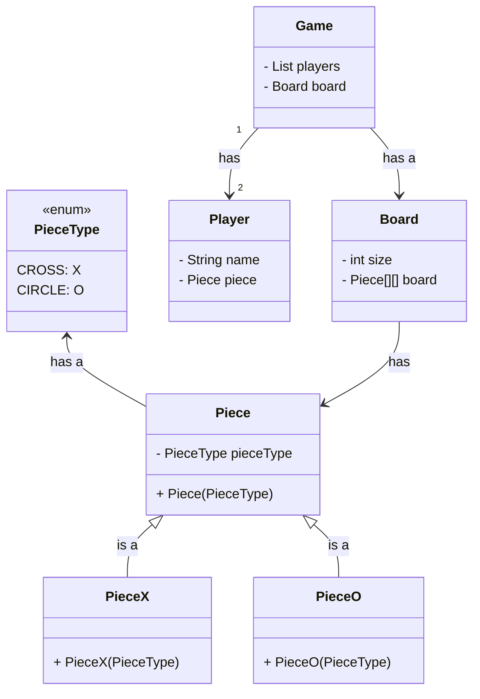

## Use Case Diagram

```mermaid

classDiagram
	class Game {
		- List<Player> players
	    - Board board
	}
	
	class Board {
		- int size
	    - Piece[][] board
	}
	
	class Player {
		- String name
	    - Piece piece
	    
	}
	
	class PieceType {
		<<enum>>
		CROSS: X
	    CIRCLE: O
	}
	
	class Piece {
		- PieceType pieceType
	    + Piece(PieceType)
	}
	
	class PieceX {
		+ PieceX(PieceType)
	}
	
	class PieceO {
		+ PieceO(PieceType)
	}
	
	PieceType <-- Piece: has a
	Board --> Piece: has
	Piece <|-- PieceX: is a
	Piece <|-- PieceO: is a 
	Game --> Board: has a
	Game "1" --> "2" Player: has 

```

