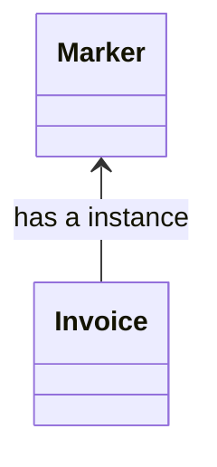
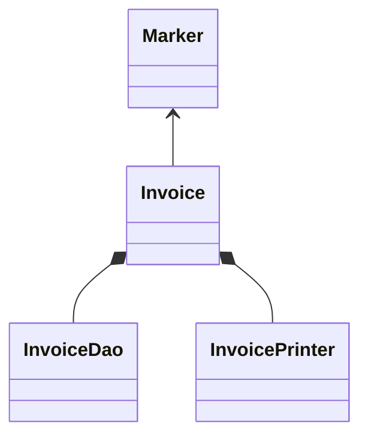

A class should have only one reason to change, meaning that a class should have only one responsibility.

It helps in 
1. easy to maintain
2. easy to understand

---





```java
class Marker {
	String name;
	String color;
	int year;
	int price;

	public Marker(String name, String color, int year, int price) {
		this.name = name;
		this.color = color;
		this.year = year;
		this.price = price;
	}
}
```


```java
class Invoice {
	private Marker marker;
	private int quantity;

	public Invoice(Marker marker, int quantity) {
		this.marker = marker;
		this.quantity = quantity;
	}

	// reason to change: change in calculation, may discount or taxes comes
	public calculateTotal() {
		return this.marker.price * this.quantity;
	}

	// reason to change: change in print logic or format
	public printInvoice() {
		// print invoice
	}

	// reason to change: we can change the db and moved to file based storage
	public saveToDB() {
		// save to db
	}
}
```


---




```java
class Invoice {
	private Marker marker;
	private int quantity;

	public Invoice(Marker marker, int quantity) {
		this.marker = marker;
		this.quantity = quantity;
	}

	public calculateTotal() {
		return this.marker.price * this.quantity;
	}
}
```

```java
class InvoiceDao {
	private Invoice invoice;
	
	public InvoiceDao(Invoice invoice) {
		this.invoice = invoice;
	}

	public saveToDB() {
		// save to db
	}
}
```

```java
class InvoiceDao {
	private Invoice invoice;
	
	public InvoiceDao(Invoice invoice) {
		this.invoice = invoice;
	}

	public saveToDB() {
		// save to db
	}
}
```

```java
class InvoicePrinter {
	private Invoice invoice;
	
	public InvoicePrinter(Invoice invoice) {
		this.invoice = invoice;
	}

	public print() {
		// print invoice
	}
}
```

