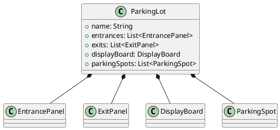
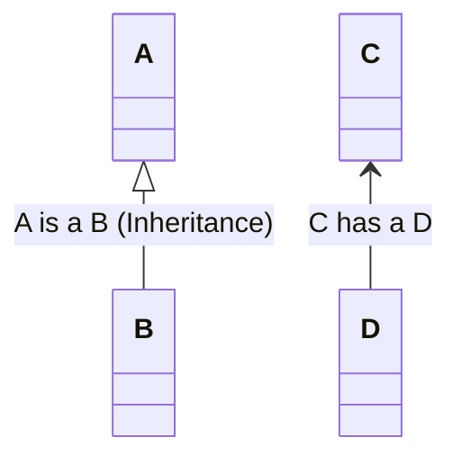
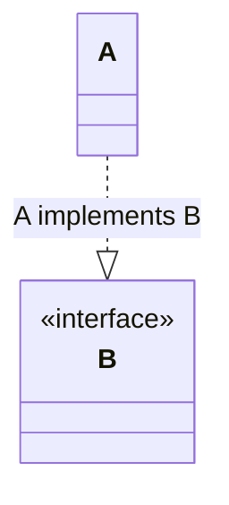

https://pdf.plantuml.net/PlantUML_Language_Reference_Guide_en.pdf

Class diagram

`+`  : public
`-`  : private
`#`  : protected
`_`  : static

| class name                             |
| -------------------------------------- |
| + variable_name: type                  |
| -------------------------------------- |
| + method_name(parameters): return_type |

Class relationship

1. Association
can call

A ---- B

both the class can call each other

it can be Unidirectional Association 
A ----> B 
A can call B, but B can not call A

Multiplecity

1. Aggregation
has an instance of

A aggregation B
B can exist without A

2. Composition
A composition B
B can not exist without A

---

