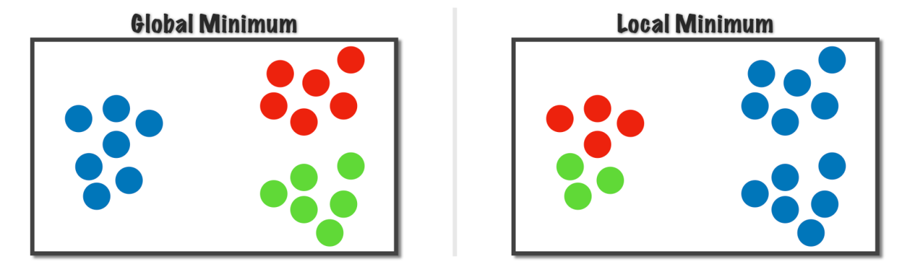

Unsupervised learning is learning with data no label, one of the way is Clustering. Other unsupervised learning techniques are PCA,  Association Rule Mining.

## What is Clustering ?
Identifying similar pattern and grouping them together. OR Grouping objects together based on similarity. It is unsupervised learning so no pre defined classes are there.

Example: Related search results, clustering users for providing personalised feeds

## What are the algorithms used for clustering ?
1. Partitioning approach: Construct various partition and then evaluate them by some criterion, eg minimising the sum of square errors (K-Means)
2. Hierarchical approach: Creates hierarchical decomposition of the set of data using some criterion, eg hierarchical agglomerative clustering (HAC)

## What is Hierarchical Agglomerative Clustering (HAC) ?

## What is K-Means clustering ?
1. partitioning clustering algorithm, as it partitions the given data into K clusters
2. it finds the circular type of clusters

#### Steps (Raw)
1. randomly take K points (not datapoint) in the same feature space, consider those as centroid of the clusters.
2. make clusters based on which datapoint is closer to which centroid
3. now based on the datapoint in a cluster, re evaluate centroid for every clusters
4. then again calculate the distances of every datapoint from the centroids and check if any other datapoint(belongs to another cluster) comes in new cluster or change its cluster.
5. continue till no datapoints changes it cluster

#### Steps
1. Randomly choose k points (seeds) to be initial centroids (cluster centres)
2. Assign each data point to the closest centroid
3. Re-compute the centroids using current cluster members
4. If a convergence criterion is not met repeat from step 2.

#### What is the Stopping / Convergence criterion ?
1. No (or minimum) re-assignments of the datapoints to different clusters, or
2. No (or minimum) change of centroids, or
3. Minimum decrease in the Sum of Squared Error (SSE).

| $$SSE = \sum_{i=1}^k  \sum_{x \epsilon C_j}  dist(x, m_j)^2$$ | 
| ----------------------------------------------------------- |

Here, $k$ is the number of cluster, $C_j$ is the $j^{th}$ cluster and $m_j$ is the centroid of $C_j$ cluster

#### What is Local Minima issue in K-Means ?

**TODO: need to complete mathematical intuitions and the reason
***Mathematically***
there is a link between K-Means and Gradient Descent, and Gradient Descent has local minima issue

***In layman terms***
sometimes the algorithm converge in the situations where clusters are not optimal

This condition arrived because of 
1. on the k value we are using
2. on the initial cluster centroids (starting points) 
###### Preventing Local Optima

1. Randomly initialise K-Means
2. Runs K-Means, get $C_1, C_2, ..., C_k$ , $\mu_1, \mu_2, ..., \mu_k$
3. Compute cost function (distortion), $J(C_1, C_2, ..., C_k, \space \mu_1, \mu_2, ..., \mu_k)$

1. We must runs the algorithm several times (usually 50 to 1000 times) 
2. Then we must choose the iteration with minimum SSE 

 

#### What is MapReduce and how it is helpful in K-Means ?
